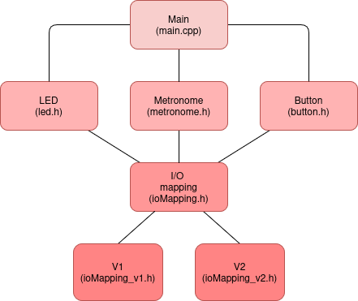

# Metronome Project

## Introduction

This repo provides the implementation of a digital metronome independent of the hardware. To interface it with a particular hardware modify the ioMapping files.

Required hardware:
- Button: To change the BPM of the metronome.
- LED: Shows the metronome's pulse.
- Buzzer **(implemented in the future)**: to create the click of the metronome.

 

*Figure 1: Digital Metronome Architecture*

Interesting features of the implementation:
- Button Debouncing: Using a timer to periodically check the status of the button. If a certain number of samples agree that the button was pressed then the event *"button_pressed"* is aknowledged.
- Metronome tick according to a timer.
## Using the Arduino Uno (ATmega328P)

Hardware interface specified in the ioMapping_v1.h and ioMapping.h files. 

Required hardware:
- Button: Pin D9, which corresponds to the pin PB1 in the microcontroller. The timer 0 requests checking the reading periodically.
- LED: Pin D13, which corresponds to the pin PB5 in the microcontroller. The timer 1 requests a toggle of the LED.
- Buzzer **(to implemented in the future)**: to be determined.

### Usage
Set the compiler flag in the `platformio.ini` before building the project with the following:

```
build_flags = -DCOMPILING_FOR_V1
``` 